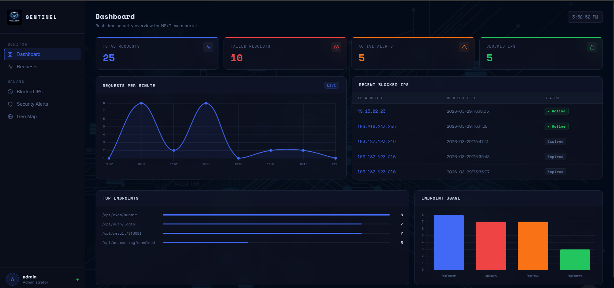
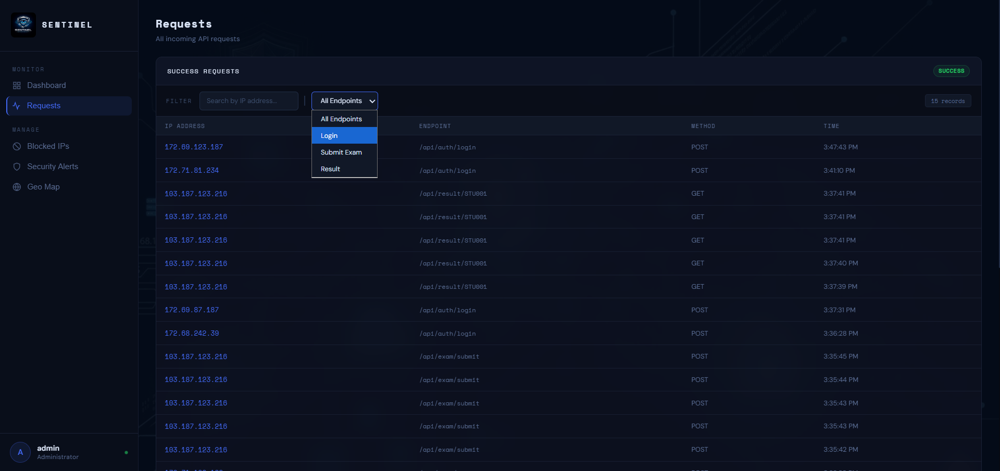
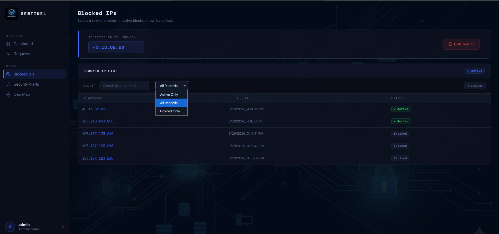
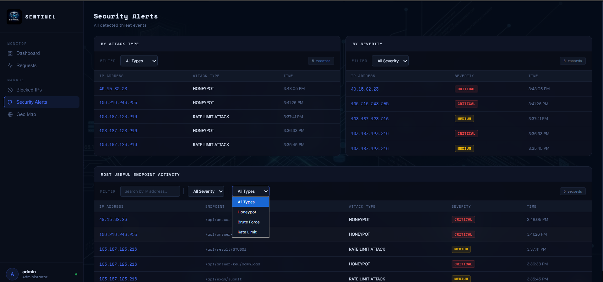
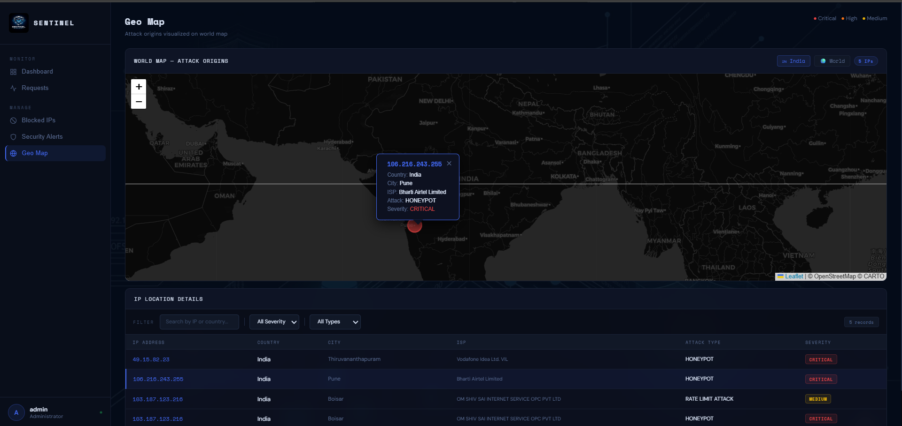
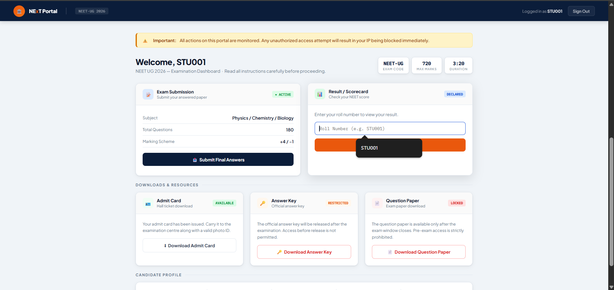

# 🛡️ Sentinel — Backend Security Monitoring System  

Sentinel is a real-time backend security system built using Spring Boot. It monitors incoming requests, detects suspicious activity, and automatically blocks malicious users while providing live insights through an admin dashboard.

> ⚡ Designed to be flexible, Sentinel can be integrated into any web application to secure backend APIs from attacks.

---

## 💡 Problem It Solves

Modern web applications are constantly exposed to threats such as:

- Brute-force login attempts  
- Bot traffic overwhelming APIs  
- Unauthorized access to sensitive endpoints  
- Lack of visibility into ongoing attacks  

Sentinel addresses these issues by actively monitoring and responding to threats in real time—without manual intervention.

---

## 🔒 Request Flow

Client Request
↓
Security Layer (Sentinel)
├── Honeypot access detected → Immediate block
├── IP already blocked → Reject request
├── Excess failed logins → Temporary block
└── Request limit exceeded → Temporary block
↓
Valid Request → Forward to application
Malicious Request → Block + Generate Alert

---

## 🚀 Core Security Features

### 🍯 Honeypot Detection
- Hidden endpoints act as traps for attackers  
- Instant block (30 minutes)  
- 🚨 CRITICAL alert  

---

### 💪 Brute Force Protection
- Tracks failed login attempts per IP  
- 5 failures in 10 minutes → Block for 30 minutes  
- 🔥 HIGH severity alert  

---

### ⚡ Rate Limiting
- Controls API request spam  
- 5 requests/min → Block for 10 minutes  
- ⚠️ MEDIUM alert  

---

## 📊 Admin Dashboard  

### 📈 Overview  

- Total Requests, Failed Requests, Active Alerts, Blocked IPs  
- Live traffic trends  
- Top endpoints  
- Recently blocked users  

---

### 📋 Request Logs  

- All incoming requests  
- Success & failed separation  
- Filter by IP & endpoint  

---

### 🚫 Blocked IPs  

- Active & expired blocks  
- One-click unblock  

---

### 🚨 Alerts System  

- Severity-based alerts  
- Full activity logs  

---

### 🗺️ Geo Tracking  

- Attack origin visualization  
- Country, City, ISP details  

---

## 🎓 Demo Integration  

Sentinel is demonstrated using a medical exam portal where users can:

- Secure login  
- Exam submission  
- Result viewing  

---

## 🛠️ Technology Stack

- Backend: Spring Boot (Java)  
- Frontend: HTML, CSS, JavaScript  
- Charts: Chart.js  
- Maps: Leaflet.js  
- Database: MySQL  
- IP Tracking: ipgeolocation API  

---

## 🌍 Use Cases

- 🛒 E-commerce platforms  
- 🏦 Banking systems  
- 🔑 Authentication systems  
- 📱 Mobile backends  
- 🌐 REST APIs  

---

## 👨‍💻 Author  

**Abhishek**
- GitHub: https://github.com/Abhishek30227

---

⭐ If you like this project, give it a star on GitHub!
